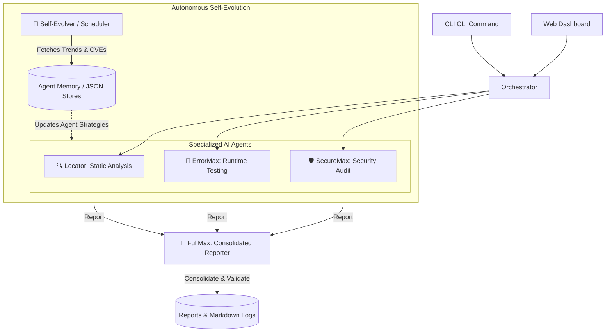

# 🤖 AI-WORKSPACE: Self-Evolving Multi-Agent System

AI-WORKSPACE is an autonomous, self-evolving multi-agent framework designed for code analysis, runtime testing, and security vulnerability auditing. It features specialized AI agents that collaborate to evaluate workspace codebases, validate stability, detect vulnerabilities, and automatically update their own intelligence/knowledge bases based on real-time CVEs and dev trends.

---

## 🏗️ System Architecture

The AI-WORKSPACE operates with a multi-layered agent architecture coordinated by an Orchestrator. 



---

## 🤖 Meet the Agents

### 🔍 Locator (Static Analysis & Bug Detection)
*   **Role**: Locates code issues, structural issues, and styling anomalies.
*   **Outputs**: Saves reports to `reports/locator-report.md`.
*   **Capabilities**: Runs static file analysis, matches error-prone syntax, and measures code structure quality.

### 🐛 ErrorMax (Runtime Testing & Diagnostics)
*   **Role**: Launches the application, runs tests, and monitors runtime logs.
*   **Outputs**: Saves reports to `reports/errormax-report.md`.
*   **Capabilities**: Catches runtime crashes, frontend/backend issues, API failures, memory spikes, and hanging loops.

### 🛡️ SecureMax (Security Auditing & CVE Matching)
*   **Role**: Audits your dependencies and source files for potential security vulnerabilities.
*   **Outputs**: Saves reports to `reports/securemax-report.md`.
*   **Capabilities**: Scans against local and online NVD databases, logs risk levels, and flags outdated/vulnerable packages.

### 🧠 FullMax (Executive Validation & Consensus)
*   **Role**: Reviews reports generated by other agents and provides an overall health index and security clearance verdict.
*   **Outputs**: Saves reports to `reports/final-report.md`.
*   **Capabilities**: Validates individual outputs and produces the final application deployment approval recommendation.

### 🧬 Self-Evolver (Continuous Evolution Feed)
*   **Role**: Operates on a scheduled cron or manual trigger to fetch external trends and newly released CVEs.
*   **Outputs**: Writes to `reports/evolution-report.md` and updates local knowledge bases in `memory/`.
*   **Capabilities**: Keeps the entire agent cluster updated against zero-days and fresh API specs automatically.

---

## 🚀 Key Use Cases

1. **Automated CI/CD Validation**: Run the `fullstack-run` engine script during pull requests to automatically audit code security, test for runtime errors, and output a validated deployment recommendation report.
2. **Interactive Debugging**: Spin up the Web Dashboard, enter a directory path, and visually monitor active agent logs, read generated markdown reports in real-time, or manually trigger the self-evolution feed.
3. **Zero-Day & Dependency Alerts**: Run the scheduler to pull current CVE databases and update SecureMax's scanning knowledge base overnight.

---

## 🛠️ Installation & Setup

### Prerequisites
*   [Node.js](https://nodejs.org/) (v18.0.0 or higher is recommended)
*   [Git](https://git-scm.com/)

### 1. Clone & Install
```bash
git clone https://github.com/jamwalgokul/self-evolving-multi-agent-system.git
cd self-evolving-multi-agent-system
npm install
```

### 2. Configure Environment Variables
Copy `.env.example` to a new file named `.env` and fill in the corresponding keys:
```bash
cp .env.example .env
```

Open `.env` in your text editor:
```env
# --- LLM Provider (OpenAI-compatible) ---
LLM_API_KEY=your-api-key-here
LLM_BASE_URL=https://api.openai.com/v1
LLM_MODEL=gpt-4o

# --- NVD (National Vulnerability Database) API Key ---
NVD_API_KEY=your-nvd-key-here

# --- Evolution Schedule ---
EVOLUTION_CRON=0 0 * * *

# --- Dashboard ---
DASHBOARD_PORT=3000
```

> [!WARNING]
> **Keep your secrets safe!** 
> Never commit your `.env` file to version control. The `.gitignore` file included in this project is pre-configured to ensure `.env` and other local development databases (like cached log files or `node_modules/`) are never uploaded to GitHub.

---

## 💻 CLI Usage Guide

All commands run through the CLI entrypoint at `engine/cli.js`.

### Run All Agents (Full-Stack Run)
Analyzes, tests, and validates a directory concurrently:
```bash
npm run fullstack-run -- ./projects/sample-app
# or
node engine/cli.js fullstack-run ./projects/sample-app
```

### Run Specific Agent Commands
*   **Run Locator Static Analysis**:
    ```bash
    npm run scan -- ./projects/sample-app
    ```
*   **Run ErrorMax Runtime Testing**:
    ```bash
    npm run test:agent -- ./projects/sample-app
    ```
*   **Run SecureMax Security Audit**:
    ```bash
    npm run audit -- ./projects/sample-app
    ```
*   **Run FullMax Consolidator**:
    ```bash
    npm run validate
    ```

### Run Self-Evolution
*   **Manual Trigger**: Fetch latest CVEs & Dev Trends manually:
    ```bash
    npm run evolve
    ```
*   **Start Scheduler**: Run the background cron worker:
    ```bash
    node engine/cli.js evolve --schedule
    ```

### Check System Status
View current agent memory versioning and entries:
```bash
node engine/cli.js status
```

---

## 🖥️ Web Dashboard

The web dashboard provides an elegant user interface to inspect agent execution, browse markdown reports, and check the evolution feed trends.

### Start the Dashboard
```bash
npm run dashboard
```

Open your browser to: **[http://localhost:3000](http://localhost:3000)**

*   **Dashboard view**: Check consolidated scores (Overall Health, Security Risk) and individual agent cards.
*   **Agents view**: Run single or parallel agent tasks on a specific codebase path.
*   **Reports view**: Read and browse agent-generated `.md` reports side-by-side.
*   **Evolution Feed**: Monitor the scheduler's retrieved CVE databases and agent changelogs.

---

## 🛡️ License

This project is licensed under the MIT License. See [package.json](package.json) for details.
